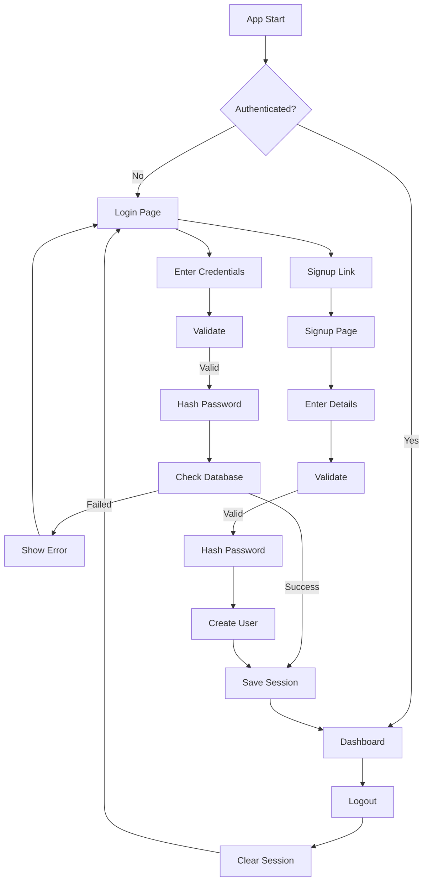

# 🎉 Authentication System Complete!

## ✅ What Was Created

### 📱 Pages

1. **Login Page** (`app/(auth)/login.tsx`)
   - Email & password authentication
   - Form validation
   - Loading states
   - Error handling
   - Link to signup page
   - Auto-redirect on success

2. **Signup Page** (`app/(auth)/signup.tsx`)
   - User registration form
   - Full name, email, password fields
   - Password confirmation
   - Comprehensive validation
   - SHA-256 password hashing
   - Auto-redirect on success

3. **Dashboard** (`app/index.tsx`)
   - User welcome with name
   - Statistics cards (projects, expenses, total)
   - Quick action buttons
   - Recent projects & expenses lists
   - Logout functionality
   - Empty state for new users

### 🔧 Components

4. **ProtectedRoute** (`components/ProtectedRoute.tsx`)
   - Authentication guard
   - Auto-redirect logic
   - Session management
   - Loading states

5. **Auth Layout** (`app/(auth)/_layout.tsx`)
   - Wrapper for auth pages
   - Consistent styling

### 🔄 Updated Files

6. **Root Layout** (`app/_layout.tsx`)
   - Integrated ProtectedRoute
   - Streamlined navigation

## 🚀 How to Use

### 1. Start the App

```bash
npm start
# or
npx expo start
```

### 2. Test Signup Flow

```
1. App opens → Redirected to Login
2. Click "Sign Up" link
3. Fill in:
   - Full Name: Your Name
   - Email: your.email@example.com
   - Password: password123
   - Confirm: password123
4. Click "Sign Up"
5. ✅ Success! Redirected to Dashboard
```

### 3. Test Login Flow

```
1. Click "Logout" from Dashboard
2. Enter your credentials
3. Click "Sign In"
4. ✅ Back to Dashboard
```

## 🎨 Features

### ✨ User Experience
- ✅ Clean, modern UI design
- ✅ Smooth animations & transitions
- ✅ Loading indicators
- ✅ Clear error messages
- ✅ Success confirmations
- ✅ Keyboard-aware scrolling
- ✅ Mobile-optimized

### 🔒 Security
- ✅ SHA-256 password hashing
- ✅ Secure session storage
- ✅ Protected routes
- ✅ Input validation
- ✅ SQL injection protection (Supabase)
- ✅ XSS prevention

### 📊 Dashboard
- ✅ User statistics display
- ✅ Project count
- ✅ Expense count
- ✅ Total expenses amount
- ✅ Recent activity lists
- ✅ Quick action buttons

## 📁 File Structure

```
RizzApp/
├── app/
│   ├── (auth)/
│   │   ├── _layout.tsx       ✅ Auth layout
│   │   ├── login.tsx          ✅ Login page
│   │   └── signup.tsx         ✅ Signup page
│   ├── _layout.tsx            ✅ Root layout
│   └── index.tsx              ✅ Dashboard
├── components/
│   └── ProtectedRoute.tsx     ✅ Auth guard
├── api/
│   ├── authApi.ts             ✅ Auth functions
│   ├── projectsApi.ts         ✅ Projects API
│   └── expensesApi.ts         ✅ Expenses API
├── services/
│   ├── databaseService.ts     ✅ Supabase client
│   └── storageService.ts      ✅ Storage sync
├── .env                       ✅ Configuration
└── schema.sql                 ✅ Database schema
```

## 🔐 Authentication Flow



## 📱 Screenshots Flow

### 1. Login Page
- Email input field
- Password input field  
- "Sign In" button
- "Sign Up" link

### 2. Signup Page
- Full Name field
- Email field
- Password field
- Confirm Password field
- "Sign Up" button
- "Sign In" link

### 3. Dashboard
- Welcome header with user name
- Logout button
- 3 Statistics cards
- Quick action buttons
- Recent projects list
- Recent expenses list

## 🎯 API Integration

All pages use the API layer:

```typescript
// Authentication
import { signup, login, logout, getCurrentUser } from '../api/authApi';

// Projects
import { getProjects, createProject } from '../api/projectsApi';

// Expenses
import { getExpenses, createExpense } from '../api/expensesApi';
```

## 🔧 Validation Rules

### Login
- ✅ Email required
- ✅ Email format validation
- ✅ Password required

### Signup
- ✅ Full name required
- ✅ Email required & valid format
- ✅ Password minimum 6 characters
- ✅ Passwords must match
- ✅ Duplicate email check

## 📊 Dashboard Stats

The dashboard automatically calculates:
- Total number of projects
- Total number of expenses
- Sum of all expense amounts
- Recent activity (last 3 projects, last 5 expenses)

## 🚨 Error Handling

All pages handle:
- ✅ Network errors
- ✅ Validation errors
- ✅ Authentication failures
- ✅ Session expiry
- ✅ Database errors

## 🎨 Styling

**Color Scheme:**
- Primary: `#007AFF` (iOS Blue)
- Background: `#f5f5f5` (Light Gray)
- Text: `#333` (Dark Gray)
- Secondary Text: `#666`, `#999`
- White: `#fff`

**Typography:**
- Titles: 32px, Bold
- Subtitles: 16px, Regular
- Labels: 14px, Semibold
- Body: 14-16px, Regular

## 🧪 Testing Checklist

- [ ] Can signup with new account
- [ ] Validation works on signup
- [ ] Can login with created account
- [ ] Validation works on login
- [ ] Dashboard shows user data
- [ ] Statistics display correctly
- [ ] Recent items display
- [ ] Logout works properly
- [ ] Protected routes redirect
- [ ] Loading states show
- [ ] Error messages display

## 📝 Next Steps (Optional)

1. **Add Forgot Password**
   - Password reset flow
   - Email verification

2. **Enhance Security**
   - Email verification on signup
   - Two-factor authentication
   - Biometric login

3. **Improve UX**
   - Remember me option
   - Social login (Google, Apple)
   - Profile editing

4. **Add Features**
   - User settings page
   - Change password
   - Delete account

## 🐛 Common Issues & Solutions

### Issue: Can't login after signup
**Solution**: Check Supabase connection and verify user was created in database

### Issue: Redirect loops
**Solution**: Clear AsyncStorage and restart app

### Issue: Session not persisting
**Solution**: Check AsyncStorage permissions

### Issue: Validation not working
**Solution**: Check console for errors

## 💡 Tips

1. **Test on Real Device**: Some features work differently on simulators
2. **Check Network**: Ensure internet connection for Supabase
3. **Monitor Console**: Watch for API errors
4. **Clear Storage**: Use `AsyncStorage.clear()` if testing

## 📚 Documentation Files

- `AUTH_PAGES.md` - Detailed authentication documentation
- `IMPLEMENTATION.md` - Overall implementation guide
- `SUPABASE_SETUP.md` - Database setup instructions
- `api/README.md` - API usage guide

---

## ✅ Status: COMPLETE & READY TO USE!

**Date**: October 20, 2025  
**Version**: 1.0.0  
**Authentication**: Custom (Supabase Users Table)  
**Pages**: Login, Signup, Dashboard  
**Protection**: ProtectedRoute Guard  
**Storage**: AsyncStorage + Supabase

### 🎉 You can now:
1. ✅ Sign up new users
2. ✅ Login existing users
3. ✅ View dashboard with stats
4. ✅ Logout securely
5. ✅ Protected route navigation
6. ✅ Full API integration

**Ready to test!** 🚀